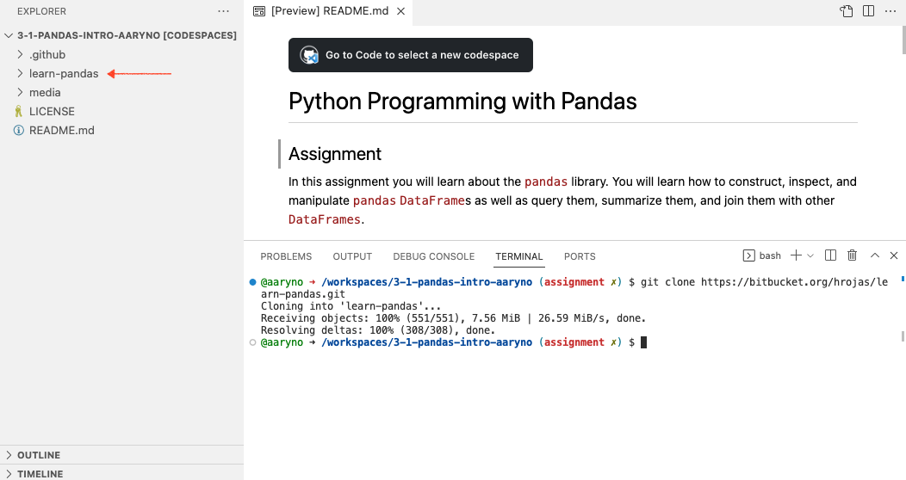
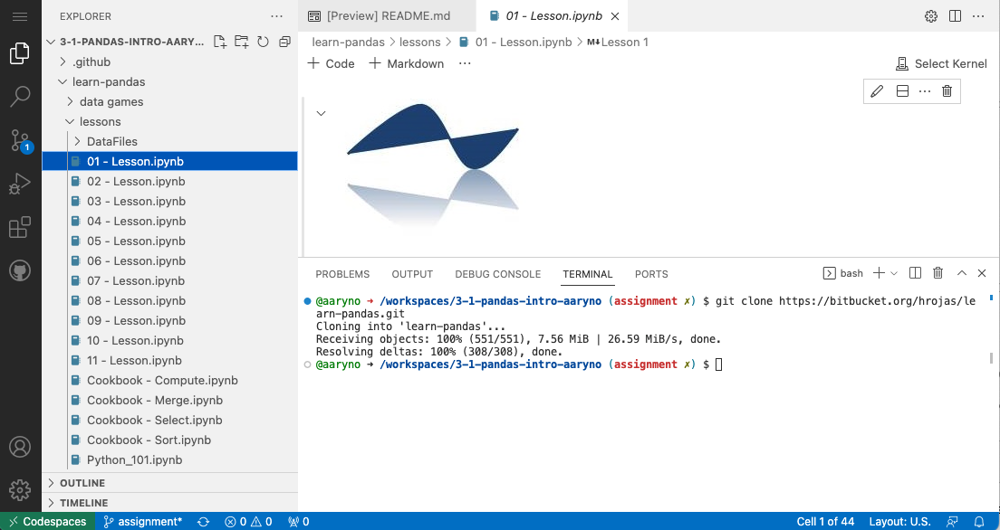
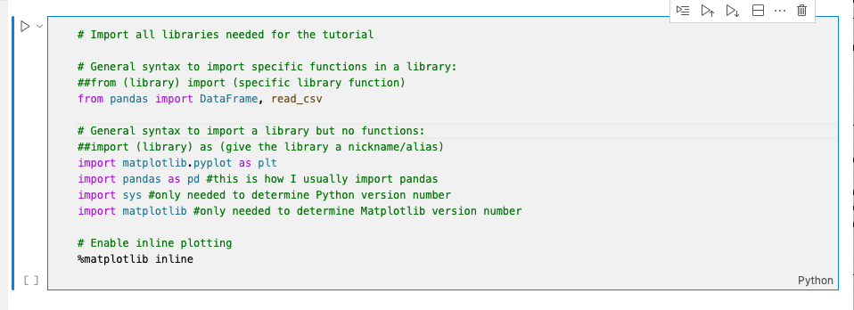

# Python Programming with Pandas

## Learning Objectives
1. Become familiar with the `pandas` library
2. Build experience using git
3. Gain experience using Jupyter Notebooks

## Assignment
In this assignment you will learn about the `pandas` library. You will learn how to construct, inspect, and manipulate `pandas` `DataFrame`s as well as query them, summarize them, and join them with other `DataFrames`.

_If you are new to python programming, watch this 60-minute tutorial to help get started: [Learn Python in One Hour](https://www.youtube.com/watch?v=kqtD5dpn9C8&ab_channel=ProgrammingwithMosh)_

### Background
[`pandas`](https://pandas.pydata.org/pandas-docs/stable/index.html) is an open source, BSD-licensed library providing high-performance, easy-to-use data structures and data analysis tools for the Python programming language. For open source vector-based GIS, pandas provides a fundamental data model for describing vector data; namely, the [`DataFrame`](https://pandas.pydata.org/docs/reference/api/pandas.DataFrame.html). `panda`'s `DataFrame` class provides a structure for `Two-dimensional, size-mutable, potentially heterogeneous tabular data`. Does that sound familiar? This is essentially an attribute table, but without the spatial component. There is a spatial extension for the data frame but it will serve us better to explore the non-spatial `DataFrame` first, learn its usage, and understand how to manipulate, join, and query data that are stored in `DataFrame`s.

For this assignment we will be following lessons Hernan Rojas provided for us at https://bitbucket.org/hrojas/learn-pandas/src/master/.

This assignment will be run through GitHub's Codespace.

## Directions
### Get started with a new codespace on a new branch
- Create a new branch named `assignment`
- Click on `Code` and `Create codespace on `assignment`

### Clone the hrojas repo about learning pandas
In the terminal window, type
```bash
git clone https://bitbucket.org/hrojas/learn-pandas.git
```
This will clone the hrojas repo to this codespace workspace. You will see a new directory show up in the `Explorer` panel as well as some text about "Receiving objects" and "Resolving deltas" in the `Terminal` panel. Afterwards, your codespace should look like this:



### Open Lesson 1 Jupyter Notebook

Expand the new directory to view the lessons, then open the file named `01 - Lesson.ipynb` by double clicking the filename in the `Explorer` panel.



This opens the file, which is a Jupyter Notebook file. We will work more with Jupyter Notebooks in a later class but it's simple enough to use for this tutorial that we can just click through the examples.

The important concepts related to Jupyter Notebooks are:
- A Notebook is simply a file divided up into cells which can be rendered or executed independently and/or in sequence against a back-end compute kernel. I know that sounds confusing but the gist of it is that we can both write code and write really clear comments, including rich text and images, and have the whole thing executed in python. 

Let's get started

### Get used to Jupyter Notebook
Each cell in a notebook is either markdown text or code. "Executing" a cell means rendering (for markdown) or executing (for code). The code cells update a running python environment (aka kernel) so that each cell can read, update, overwrite, or delete variables that were set or modified in previous cells. When a code cell is executed, its output is printed just below that cell.

_Clear Outputs of All Cells_

When you open Lesson 1, the output from all the commands makes this tutorial difficult to read. At the top of the notebook (in the same line that it has the kernel), find the option to "Clear Outputs of All Cells" and click that. 

Next, scroll down to where there is a greyish box containing Python code. This will be the second cell. When you click on it, it will appear highlighted with a blue bar to the left of the cell. This also gives us an indication for how large the cell is; where it begins and where it ends. 



Notice also that it has a triangle to the left of the top corner of the cell. This is a button to execute the cell.

Notice second that there is a set of square brackets to the left of the bottom corner of the cell. This indicates whether the cell has been executed or is being executed. When it has completed you will see a number, which indicates how many cells have been executed in the kernel before this cell.

Click the Triangular button to execute the cell. When it is completed, activate the next cell containing `print('Python version ' + sys.version)` and execute that cell as well.

It should look like this:


This was just a brief introduction to using this Jupyter Notebook. Next, focus your attention on the content of the Lessons and walk through it.

### Lessons

#### Lesson 1
Follow the 01 - Lesson.ipynb tutorial and take a screenshot (`lesson1.png') showing your notebook at the last step. It should show the graph and the most popular name.

#### Lesson 2
Follow the 02 - Lesson.ipynb tutorial and take a screenshot (`lesson2.png') showing your notebook at the last step. It should show a table of names sorted by births and the associated graph.

#### Lesson 3
Follow the 03 - Lesson.ipynb tutorial and take a screenshot (`lesson3.png') showing your notebook at the last step. It should show a figure containing the graph showing all 4 states.

#### Lesson 4
Follow the 04 - Lesson.ipynb tutorial and take a screenshot (`lesson4.png`) showing your notebook at the last step. It should show the last 5 records of `df`.

#### Lesson 5
Follow the 05 - Lesson.ipynb tutorial and take a screenshot (`lesson5.png') showing your notebook at the last step. Show the output of letterone without the index.

### Deliverables
You should have 5 screenshots:
- `lesson1.png`
- `lesson2.png`
- `lesson3.png`
- `lesson4.png`
- `lesson5.png`

Include those in a branch named `pandas` and submit a `Pull request` to merge with `master`. Do not merge!

Note that there are now several ways that you can create a branch and submit a Pull Request. In this case I suggest using either GitHub Desktop or by committing the files directly in the browser.
